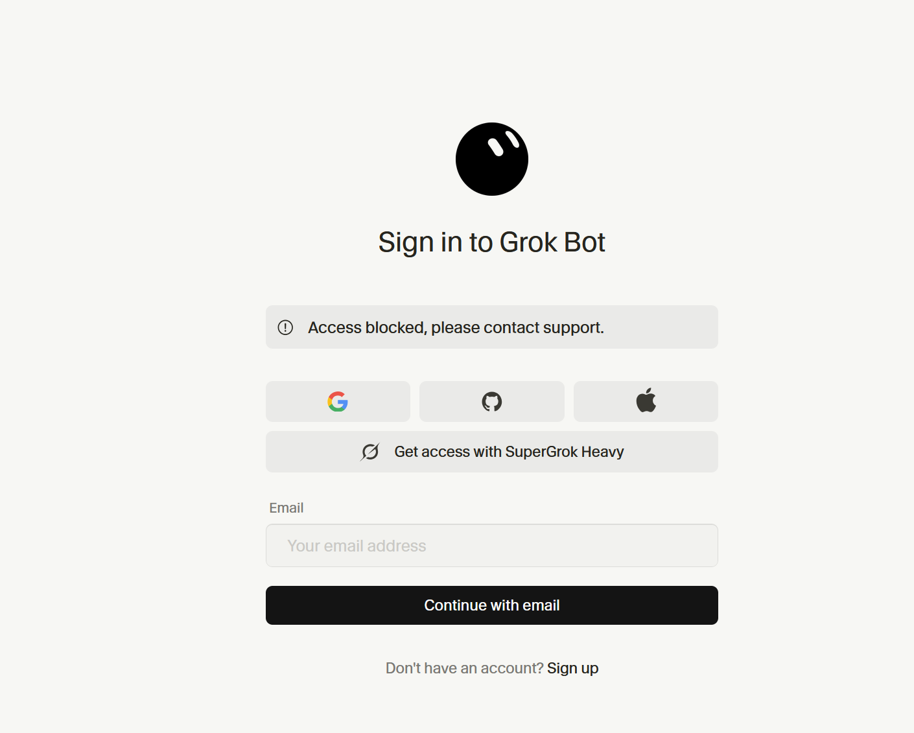

# SuperGrok Heavy / Cursor Grok Bot `policy_denied` incident

This repository is a privacy-sanitized public evidence hub for an unresolved paid-feature access failure involving xAI's SuperGrok Heavy subscription and Cursor's Grok Bot linking flow.

## Start here

- **[Open the public incident page](https://coolak.github.io/cursor-grok-bot-policy-denied/)**
- **[Read the reporter-ready brief](reporter-brief.md)**
- **[Inspect the dated timeline](timeline.md)**
- **[Review every escalation action](actions.md)**
- **[Read the evidence and limitation register](evidence.md)**
- **[Inspect the machine-readable state](incident-state.json)**

## Short summary

The customer has a paid SuperGrok Heavy subscription attached to an X-authenticated identity whose valid email address ends in `.ru`. xAI publicly states that Grok Bot is included with SuperGrok Heavy.

The customer followed Cursor's **Get access with SuperGrok Heavy** path. X authorization succeeded, but Cursor's callback returned `policy_denied` and the Grok Bot sign-in page displayed **“Access blocked, please contact support.”**

Cursor support later stated that the SuperGrok and Cursor account email addresses must match and that a successful link is permanent and cannot be moved. The customer does **not** require the benefit on the pre-existing non-`.ru` Cursor account: creation of a new personal Cursor account using the matching `.ru` address is acceptable. That matching-address path is the path that remains blocked.

The evidence is therefore consistent with an unpublished domain-level eligibility rule or implementation block. Cursor has not confirmed that inference, identified the backend policy, supplied a working matching-address route, or provided a documented remedy.

## Reproducible failure

1. Start from Grok Bot's plan screen.
2. Choose **Get access with SuperGrok Heavy**.
3. Continue to xAI/X authorization.
4. Authorize Cursor to verify identity and read the account email.
5. The browser returns to Cursor's bot-auth callback with `error=policy_denied`.
6. Grok Bot shows **“Access blocked, please contact support.”**
7. The paid Grok Bot entitlement is not activated.

The failure was reproduced after creating fresh authorization sessions, disabling ordinary proxy/VPN variables, and after Cursor support said it had refreshed relevant backend settings.

## What the vendors have said

- Cursor's automated support said the pre-existing Cursor account was an individual account, not a team or enterprise account.
- Cursor asked for a retry without VPN/proxy interference, screenshots, subscription type, and the X/Grok account email. Those requests were satisfied.
- A Cursor billing-support representative said backend settings had been refreshed and requested another retry. The same error returned.
- Cursor then stated that the SuperGrok and Cursor emails must match and that successful links cannot be undone or moved.
- A later Cursor representative forwarded the case to the Grok Bot technical team, but supplied no owner, backend finding, remedy, or ETA.
- xAI support routed the issue back to Cursor, saying Cursor owns Grok Bot support.
- Cursor's automated support immediately closed that transferred request as a duplicate of the original still-unresolved case.

The private correspondence is summarized rather than reproduced because it contains personal account identifiers, authentication metadata, and private support-routing details.

## Public evidence

- xAI announcement: [Grok Bot is now included with more plans](https://x.ai/news/grok-bot-more-plans)
- Reddit evidence thread: [SuperGrok Heavy Grok Bot: matching `.ru` email gets `policy_denied`](https://www.reddit.com/r/cursor/comments/1w6p3gi/supergrok_heavy_grok_bot_matching_ru_email_gets/)
- X incident thread: [initial public report](https://x.com/Coolak777/status/2095666718429589769)
- X correction: [matching-account clarification](https://x.com/Coolak777/status/2095666806040236440)
- X Reddit amplifier: [public evidence link](https://x.com/Coolak777/status/2095671328988856616)
- Public error screenshot: [`assets/access-blocked.png`](assets/access-blocked.png)
- Evidence hashes and custody notes: [`evidence-manifest.json`](evidence-manifest.json)

## Why this matters

This is not merely a generic login failure. It combines:

- an advertised benefit of a paid AI subscription;
- a successful identity-provider authorization followed by a partner-side `policy_denied` response;
- an irreversible one-to-one linking rule;
- an apparent account-domain restriction that has not been publicly documented or confirmed;
- two vendors redirecting responsibility while the benefit remains unavailable; and
- no safe, supported workaround for a customer willing to create the required matching account.

The repository does not claim that a particular law, sanctions rule, or discriminatory policy has been violated. It documents an unresolved consumer-entitlement and platform-governance question and asks the vendors to identify the actual rule and remedy.

## Correction to the original account framing

Early support messages treated the pre-existing non-`.ru` Cursor account as the desired target. That is no longer the customer's requirement.

The corrected requirement is:

- a new personal Cursor account using the X/SuperGrok identity's matching `.ru` address is acceptable;
- the customer authorizes that route if Cursor supports it;
- no irreversible Grok link should be completed until the target account is visibly confirmed; and
- the unresolved problem is the inability to complete the matching-`.ru` account path.

This correction was sent to Cursor in writing on September 3, 2026.

## Current status

**Unresolved as of 2026-09-04 01:04 UTC.**

- Grok Bot access has not been verified working.
- Cursor has not confirmed the precise backend reason for `policy_denied`.
- Cursor has not supplied a supported matching-`.ru` signup/linking path.
- No human technical owner or firm remediation ETA has been provided.
- Public posts are live.
- A staged press campaign has reached 21 distinct verified recipients without an immediate delivery failure.
- Monitoring and evidence preservation continue every six hours.

## What would count as resolution

At least one of the following, verified in the live product:

1. Cursor permits creation/use of a new personal account with the matching `.ru` address and the SuperGrok Heavy entitlement links successfully.
2. Cursor or xAI supplies another supported linking method that preserves the paid entitlement and avoids an irreversible link to the wrong account.
3. If access is intentionally unavailable, the responsible vendor publishes the restriction and provides an appropriate refund, service credit, or other billing remedy.

A generic “forwarded,” “duplicate,” “please wait,” or “settings refreshed” response is not resolution.

## Privacy boundary

This repository intentionally omits:

- complete customer email addresses;
- the private support-ticket identifier;
- Gmail message, thread, and mailbox identifiers;
- OAuth nonce, state, authorization-session, and callback identifiers;
- raw email headers and private support transcripts;
- IP address, ISP, exact location, and raw browser/network logs;
- subscription receipts or payment identifiers;
- the original authorization-consent screenshot because it visibly contains the private X-linked email address; and
- journalist email addresses and other outreach contact details.

The public record preserves dates, roles, technical outcomes, corrections, vendor-routing events, public URLs, and cryptographic hashes sufficient to distinguish the retained source artifacts.

## Accuracy and update policy

- Confirmed observations are separated from inferences.
- The `.ru` domain being the policy trigger remains an inference until Cursor confirms it.
- Support correspondence is paraphrased and stripped of identifiers.
- Material corrections are preserved rather than silently rewritten.
- New evidence, vendor replies, public actions, and resolution tests will be appended with UTC timestamps.

